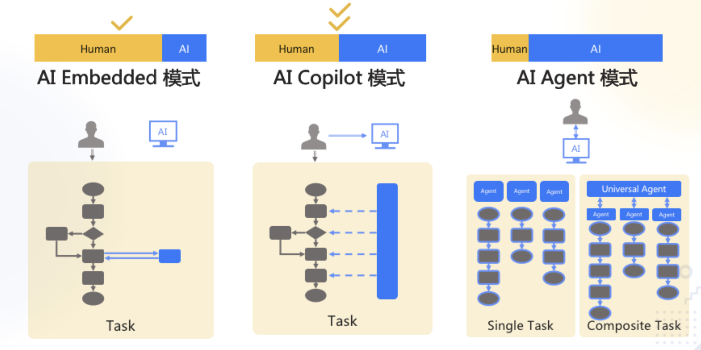
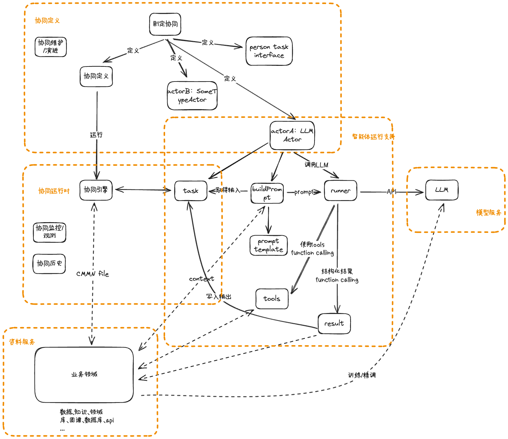
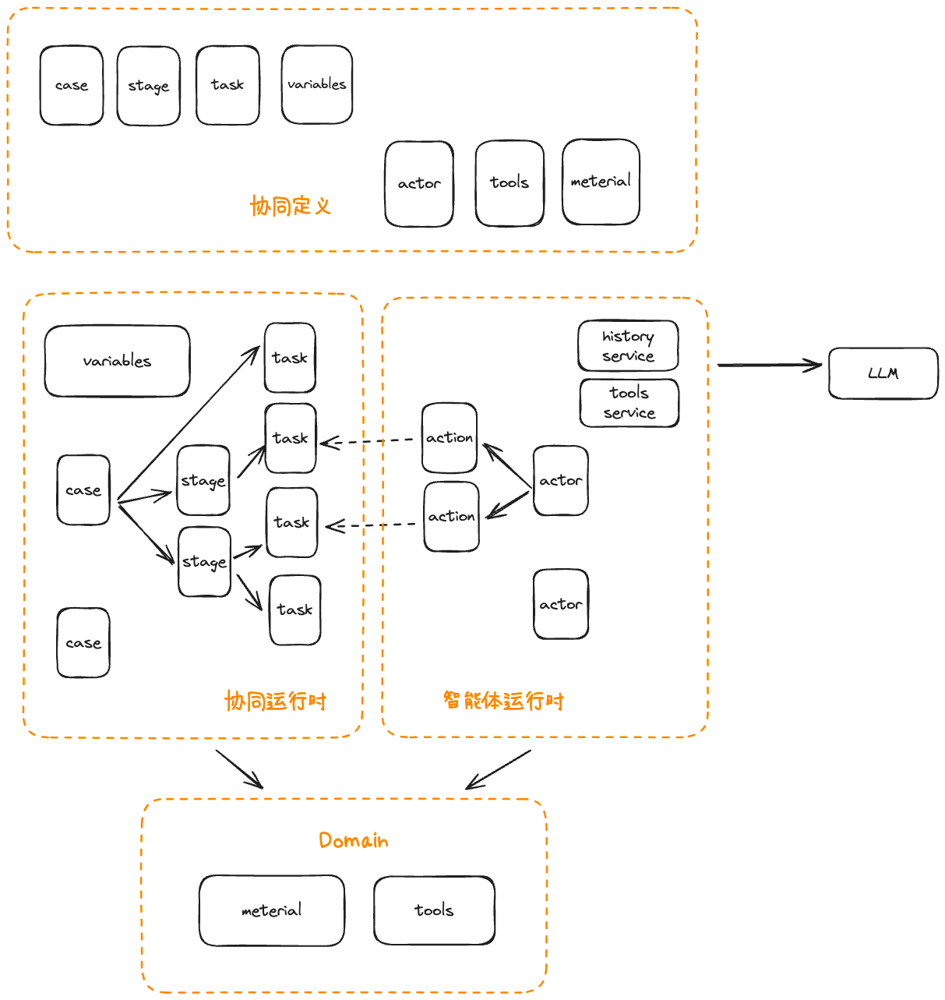
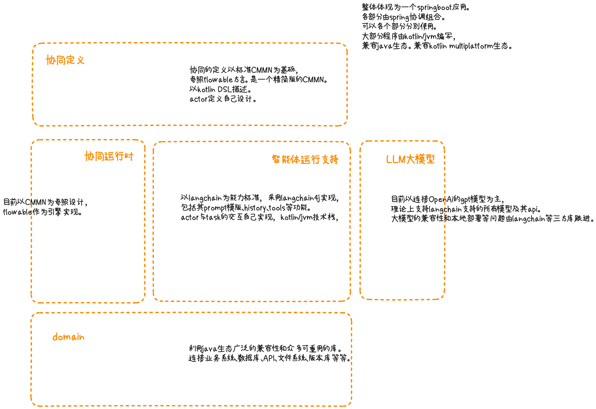

# 沧浪 - 智能体协同框架

A copilot/agent coordinating framework。
一个智能体协同框架。

### 智能体 - Actor
Copilot或者Agent？  
本框架不着力区分，认为完成独立任务的是单个智能体（actor），不论他们之间的协同由人类主导（Copilot）还是AI主导（Agent）。  
相对于Agent，Copilot的主要特点是协同模式不会自动设计，而主要由人类决定和维护。复杂任务的分工设计工作，可能是人类所面临的工作中最复杂最敏感的工作之一，被多方面严密关注，这种工作我认为AI暂时不会取代人类，可能会很快加入到人类。  
所以目前的AI参与人类工作，会以Copilot模式为主。  
同时Copilot模式也有很好的向前兼容（Forwards Compatibility）的能力。毕竟我认为业务copilot+流程设计copilot = 业务agent。

 

## 设计

本协同框架大概有如下一些职能。
1. 协同定义 - 包括协同过程的定义描述，其演进和维护。智能体的职责分配，相互之间的沟通方式等。
2. 协同运行时 - 支持协同的运行，智能体之间、智能体与环境、领域之间的沟通等机制的实现。
3. 智能体运行支持 - 提供智能体本身运行时需要的支持。包括构建prompt、使用资料、上下文，沟通大模型等。
4. 资料服务 - 提供资料服务，包括资料的存储、查询、更新等。同时也看成时对专业领域的封装。
5. 模型服务 - 提供大模型的沟通、维护、切换等。

### 总体

职能之间相互联系如下图所示。

### 协同的运行 - Coordinating

协同是指多个智能体在一个综合任务中，相互分工，相互协作，共同完成任务。  
框架中的概念主要如下图所示。
1. 协同任务被定义为“case”。每个case包含若干的stage和task，其中task是与智能体（actor）产生关系的主体，stage是一个层级概念，用于组织task。
2. actor是智能体，类比于人类工作中的一个角色。他要做的事情分为各种action，action是一个单一的任务。
3. domain是业务领域，其中包含各种业务能力、文档材料、数据、中间制品等，对于协同运行时来说，它主要提供数据。对于智能体来说，它提供数据和工具。

### 技术架构

1. https://www.omg.org/spec/CMMN/1.1
2. https://www.flowable.com/open-source/docs/cmmn/ch06-cmmn
3. https://kotlinlang.org
4. https://github.com/langchain4j/langchain4j

## 如何使用？

见案例。[文档写作](./docs/document.md)

## Usecase 

一些典型的使用案例 - 
1. 一个文档的共同写作。 [文档写作](./docs/document.md)
2. 一个软件开发流程。 [软件开发](./docs/softwareDev.md)

## FAQ

#### 为什么叫沧浪？

konglong kanglang konglong kang -> kanglang -> 沧浪

#### 为什么用CMMN
1. 有完整的概念定义和描述标准。一个人类可用、可读的描述很重要。可以由人类生成维护，也可以由AI生成，人类review确认。
2. 有现成的实现。包括引擎和表单等。
3. 相对与流程驱动的协作模式（比如BPMN），是数据驱动的。更适合脑力劳动的case。同时也留下扩展到BPMN、DMN等更多协作模式空间。

#### 支持哪些LLM？  
以LangChain4j支持的LLM为准。

#### 为什么不是用Python？
大家都要玩玩AI不是么？有很多兄弟是喜欢Java的呢。

#### 为什么Kotlin
因为我喜欢。与Java生态无缝兼容，可以与Java互操作。就当是超多语法糖的Java来用吧。

#### VS MetaGPT
MetaGPT的目标是全面的智能体，而沧浪的目标是搭建智能体的框架。
特别是，MetaGPT的协同模式是由AI决定的，沧浪的协同模式是由人类决定的。
MetaGPT期望AI自主完成一个复杂任务，而沧浪期待AI在复杂任务中协助人类。
